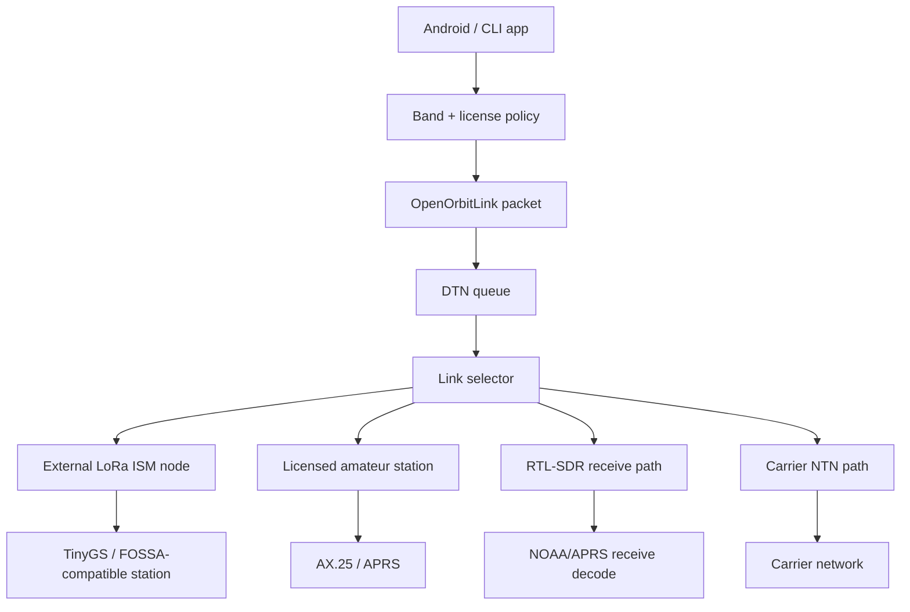
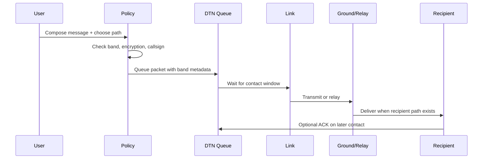

# OpenOrbitLink Architecture

## System Shape

OpenOrbitLink is a delay-tolerant communications stack with multiple physical
paths. The architecture is intentionally path-aware because each path has
different hardware, latency, encryption, and regulatory constraints.

## Capability Matrix

| Component | TX | RX | Encryption | License Gate | Current Scope |
|:---|:---:|:---:|:---:|:---:|:---|
| Android app alone | No arbitrary RF | Phone modem only | App-layer only | Carrier/OS | UI and queueing; no direct SDR TX. |
| RTL-SDR V4 | No | Yes | N/A | Usually no RX license | NOAA/APRS receive and demos. |
| LoRa SX1276/SX126x node | Yes | Yes | Yes on ISM | Regional ISM rules | Best open encrypted messaging path. |
| ISS APRS / amateur AX.25 | Yes with station | Yes | No | Ham license required | Plaintext APRS-compatible packets only. |
| TinyGS station | Config-dependent | Yes | API transport only | Depends on TX config | API client and receive/relay integration. |
| Carrier NTN | Carrier-managed | Carrier-managed | Yes | Carrier subscription | Future/convergence layer, not open RF. |

## Security Boundary

Encryption is selected after the band is known:

1. User or router chooses a transmit band.
2. `LicenseGate` checks callsign and operator attestation for amateur TX.
3. `EncryptionPolicy` blocks confidentiality on amateur and receive-only paths.
4. `OpenOrbitLinkPacket` serializes the band and encrypted flag.
5. BPSec BCB validation rejects confidentiality blocks on prohibited bands.

This prevents the old contradiction where the README promised post-quantum E2E
encryption while also claiming amateur satellite compatibility.

## Regulatory Section

| Rule Area | Architecture Decision |
|:---|:---|
| Amateur encryption | Amateur `TransmitBand` allows plaintext plus integrity only. |
| Amateur operator ID | Mesh and routing require a syntactically valid callsign plus local license attestation before TX. |
| ISM regional limits | LoRa path is modeled separately; docs and code avoid global "free spectrum" claims. |
| PSTN interconnect | Not part of the satellite RF path; must use a legal SIP/PSTN provider through an internet gateway. |
| Receive-only hardware | RTL-SDR appears only as receive/decode, never uplink. |
| TLE freshness | Predictor tracks loaded TLE epoch and exposes refresh warnings. |

## Data Flow

## Product Positioning

OpenOrbitLink is strongest as an auditable, open, asynchronous messaging layer
for places where carrier networks are unavailable or not trusted. It should not
be framed as a drop-in replacement for cellular voice or emergency dispatch.
