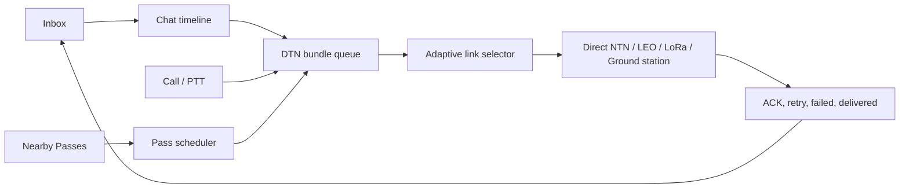

# OpenOrbitLink System Architecture

## Overview

OpenOrbitLink is a 7-layer open satellite communication stack designed for decentralized,
free communication over amateur and research satellite networks.

## Architecture Diagram

```
┌─────────────────────────────────────────────────────────────────────┐
│                    LAYER 7: ORBITAL NETWORK                         │
│              ISS APRS · OSCAR · NOAA · CubeSats · TinyGS           │
│                      500-600km LEO orbits                           │
├─────────────────────────────────────────────────────────────────────┤
│                   LAYER 6: GROUND STATIONS                          │
│     SatNOGS · RPi Relay · LoRa Gateway · grpc.aio Server           │
│              500+ stations · 7 RPCs · 15 message types              │
├─────────────────────────────────────────────────────────────────────┤
│                    LAYER 5: AI ROUTING                               │
│        TFLite Doppler Prediction · Orbital Link Manager             │
│           IIS-LSTM · Q-Learning Satellite Selection                 │
├─────────────────────────────────────────────────────────────────────┤
│                   LAYER 4: ANDROID APP                              │
│        Kotlin · Jetpack Compose · 11 Screens · CameraX · osmdroid   │
│           3 Hardware Paths: NTN / SDR / LoRa · Haptic · Biometric   │
├─────────────────────────────────────────────────────────────────────┤
│                 LAYER 3: PROTOCOL STACK                              │
│          OpenOrbitLink Protocol: AX.25 + CCSDS + DTN hybrid               │
│       6 payload types · RS FEC · CRC-16 · Store-and-Forward         │
├─────────────────────────────────────────────────────────────────────┤
│                    LAYER 2: DSP                                      │
│        BPSK/QPSK Demod · Reed-Solomon · Viterbi FEC                 │
│            Codec2 700bps · Barker-13 Sync · Doppler                 │
├─────────────────────────────────────────────────────────────────────┤
│                  LAYER 1: RF PHYSICAL                                │
│         RTL-SDR V4 · HackRF One · LoRa SX1276 · NTN Modem          │
│                  137 MHz - 6 GHz coverage                           │
└─────────────────────────────────────────────────────────────────────┘
```

## Security Stack

```
Application:  Signal Protocol SPQR (Triple Ratchet + ML-KEM)
Transport:    PQ-WireGuard (hybrid classical + post-quantum)
Bundle:       BPSec RFC 9172 (per-hop integrity, E2E confidentiality)
```

## Data Flow

1. User composes message on Android app
2. Message encrypted with Signal SPQR + ML-KEM-768
3. Encoded into OpenOrbitLink packet with RS FEC + CRC-16
4. Queued in DTN bundle store (SQLite)
5. During satellite pass window -> burst transmitted
6. Ground station receives via protobuf/gRPC streaming -> stores -> relays
7. Recipient's device receives on next pass
8. ACK returned to confirm delivery

## Product Layer



The product layer makes delay visible instead of pretending satellite delivery is instant. Threads show unread counts, queued bundle counts, next usable pass, retry state, and reliability. Calls use half-duplex PTT with text fallback because intermittent satellite voice behaves as bursts, not continuous cellular audio.

## Key Design Principles

- **Decentralized**: No single point of failure
- **Delay-Tolerant**: 90-minute max latency is acceptable
- **Legal**: Only amateur/ISM/research bands
- **Affordable**: $0-$80 total user cost
- **Open Source**: GPLv3, all code public

## Android App Screens (13)

| Screen | Nav | Description |
|:---|:---:|:---|
| Messages | Primary | Inbox + chat timeline with queued/waiting/sent/delivered/failed states |
| Satellite Map | Primary | osmdroid live map with ISS/NOAA/OSCAR positions |
| Link Dashboard | Primary | Real-time SNR gauge, Doppler dial, BER/FEC metrics |
| Emergency SOS | Primary | One-tap GPS + distress signal with haptic feedback |
| Hub | Primary | Feature grid + settings toggles |
| Nearby Passes | Secondary | Foreground discovery cards for visible-now, next-pass, and best-reliability contacts |
| Call / PTT | Secondary | Half-duplex satellite voice UI with packet-loss quality and text fallback |
| Satellite Tracker | Secondary | Pass predictions with quality scores |
| Mesh Network | Secondary | LoRa/BLE peer scanning and relay status |
| Sky Scanner | Secondary | Polar sky plot with radar sweep and obstruction analysis |
| Network Path | Secondary | Animated data flow through Phone > LoRa > GS > Satellite |
| Ground Station | Secondary | Remote antenna control, frequency tuning, packet feed |
| Hardware Setup | Secondary | 3-path wizard (NTN/SDR/LoRa) with checklists and BOM |

## Ground Station gRPC API

7 RPCs defined in `ground_station/freesat.proto`:

| RPC | Type | Description |
|:---|:---|:---|
| `GetStatus` | Unary | Station ID, uptime, hardware, location |
| `GetTelemetry` | Unary | Signal, SNR, Doppler, BER, temperature |
| `StreamPackets` | Server stream | Live decoded packet feed |
| `StreamWaterfall` | Server stream | FFT waterfall spectrum data |
| `ControlAntenna` | Unary | Set azimuth/elevation, tracking mode |
| `SetFrequency` | Unary | Tune receiver, set modulation/gain |
| `RunSpeedTest` | Unary | Measure link throughput and latency |
