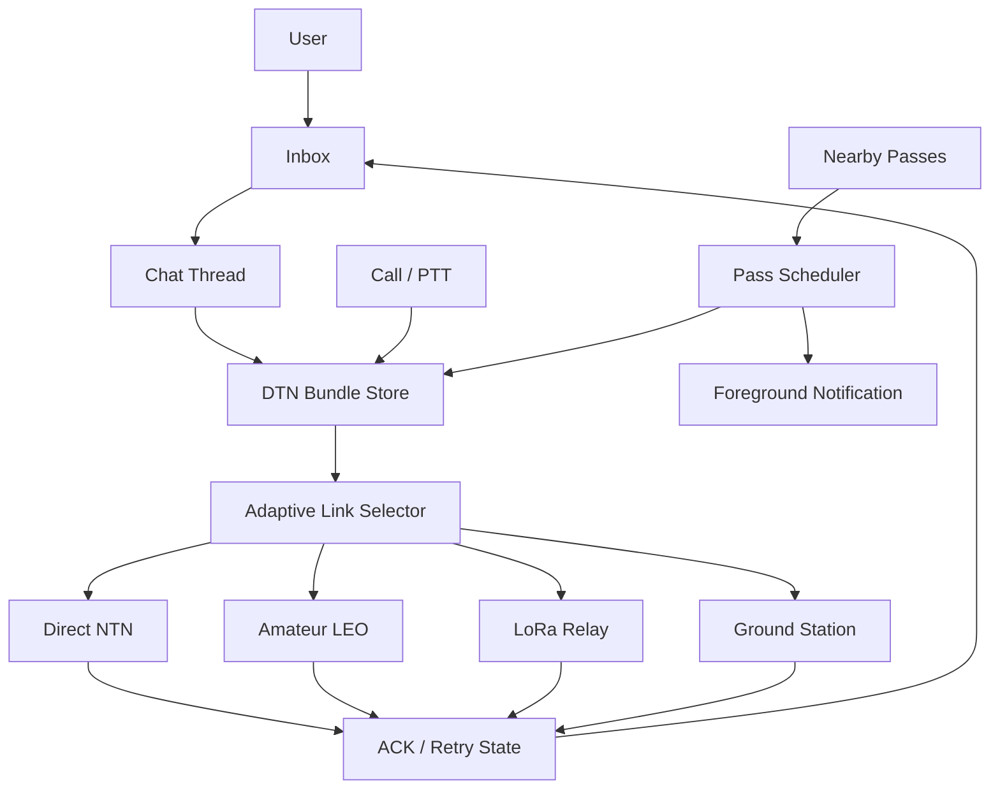

# OpenOrbitLink Product Layer Roadmap

## Goal

OpenOrbitLink should feel less like a lab console and more like a reliable communication tool. The user needs to know:

- who they are talking to;
- what is queued;
- when the next usable pass opens;
- which link path will be used;
- whether text, voice, or SOS will probably succeed.

## Product Architecture

## Android Surfaces

| Surface | Required behavior | Current repo status |
|:---|:---|:---|
| Inbox | Thread list, unread badge, queued count, next pass, reliability hint | Compose prototype in `MessagingScreen` |
| Chat | Message timeline, quoted replies, delivery states, retry, attachment placeholder, voice-burst row | Compose prototype in `MessagingScreen` |
| Call / PTT | Half-duplex voice, outgoing/listening state, mute, speaker, packet-loss indicator, text fallback | Compose prototype in `CallPttScreen` |
| Nearby Passes | Visible-now, next-pass, best-reliability cards with primary action | Compose prototype in `NearbyPassesScreen` |
| SOS / Status | One-tap distress, route priority, ACK retry until confirmed | Existing `EmergencySOSScreen` |
| Background engine | Foreground service, notification channel, scoring model, battery-aware refresh hook | `NearbyPassService` + `NearbyPassScorer` skeleton |

## Delivery State Model

| State | Meaning | User action |
|:---|:---|:---|
| `QUEUED` | Stored locally but no pass selected yet | Wait or reprioritize |
| `WAITING_FOR_PASS` | Assigned to a future contact window | Track pass |
| `SENDING` | Burst is being transmitted | Watch quality |
| `SENT` | Uplink was attempted successfully | Wait for ACK |
| `DELIVERED` | ACK returned by recipient or relay | None |
| `FAILED` | Link closed, FEC failed, or TTL expired | Retry or change route |

## Nearby-Pass Scoring

The nearby-pass engine is not a constant RF scan. It is a scheduler that combines location, time, TLE/SGP4 prediction, and link telemetry into a contact score.

Current prototype weights:

| Input | Weight | Reason |
|:---|:---:|:---|
| Elevation | 45% | Low-elevation and beam-edge links are less reliable |
| Duration | 25% | Longer windows allow retries and ACK exchange |
| SNR margin | 20% | Stronger links survive Doppler, fading, and obstruction |
| Battery wait cost | 10% | Shorter waits reduce foreground-service drain |

## D2D / NTN Implications

The 2026 D2D/NTN ICNS paper supports a hybrid mental model: terrestrial and non-terrestrial links should complement each other, not compete as separate apps. For OpenOrbitLink, that means:

- prefer TN or ground-station paths when they are dense and reliable;
- use NTN and amateur LEO windows for coverage gaps and resilience;
- penalize low-elevation satellite contacts unless the predicted link margin is strong;
- show reliability, pass duration, and queue state before technical charts;
- keep continuous discovery user-visible because Android restricts hidden background work.

## Next Implementation Steps

1. Persist threads, messages, delivery state, retry count, and expiry in Room.
2. Connect `NearbyPassScorer` to real SGP4 output from the orbital predictor.
3. Start/stop `NearbyPassService` from the Nearby Passes screen after permission checks.
4. Add Android Telecom integration for real incoming/ongoing call UX when voice transport is ready.
5. Wire PTT frames to Codec2 JNI and DTN bundle priority.
6. Add notification actions: Prepare, Track, Send queued, Pause discovery.
7. Add unit tests for pass scoring thresholds and delivery-state transitions.
