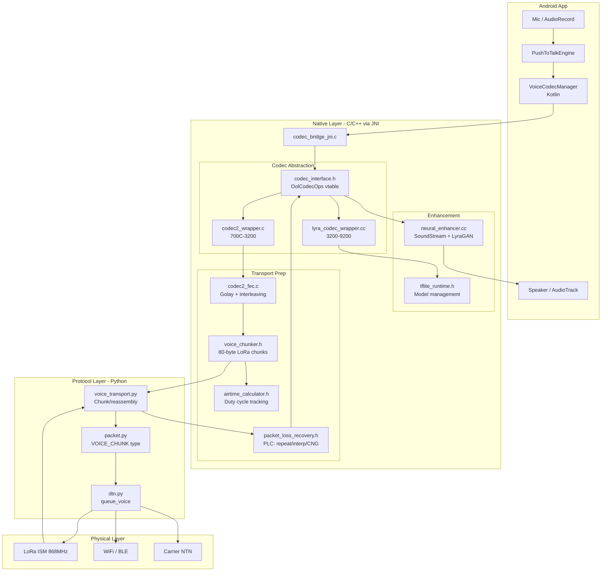
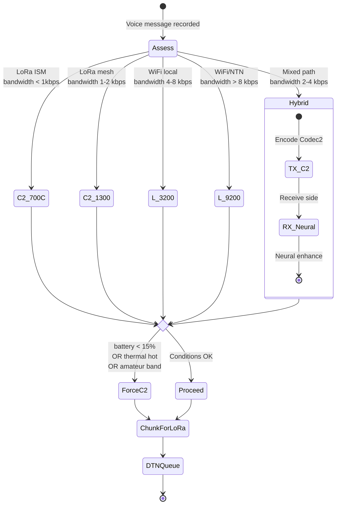
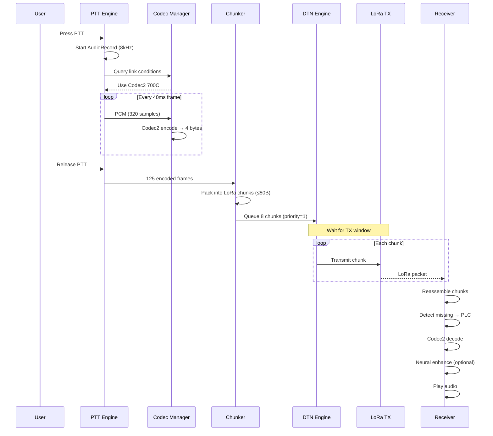

# Voice Codec Architecture — OpenOrbitLink

## Overview

OpenOrbitLink uses a **hybrid adaptive voice codec stack** that operates across wildly different link conditions — from 700bps LoRa mesh to WiFi/NTN paths. The system degrades gracefully, never assumes internet, and keeps neural enhancement strictly optional.

## Core Design Principles

1. **RF-First**: Codec2 owns the transport layer — deterministic, bandwidth-minimal, FEC-ready
2. **Neural-Optional**: Lyra-inspired enhancement is a receiver-side post-processor, never required
3. **Asynchronous Voice**: Push-to-talk voice messages, NOT real-time streaming
4. **Adaptive**: Codec selection responds to link conditions, battery, and regulatory constraints
5. **DTN-Native**: Voice chunks integrate with the store-and-forward bundle engine

## System Architecture



## Codec Comparison

| Property | Codec2 700C | Codec2 1300 | Lyra 3200 | Lyra 9200 |
|----------|-------------|-------------|-----------|-----------|
| Bitrate | 700 bps | 1300 bps | 3200 bps | 9200 bps |
| Frame size | 4 bytes/40ms | 7 bytes/40ms | 8 bytes/20ms | 23 bytes/20ms |
| Quality (MOS) | ~2.5 | ~3.0 | ~3.5 | ~4.0 |
| CPU cost | Negligible | Negligible | ~50ms/s | ~50ms/s |
| Model size | 0 | 0 | 3.5 MB | 3.5 MB |
| LoRa-safe | ✅ | ✅ | ❌ | ❌ |
| Deterministic | ✅ | ✅ | ❌ | ❌ |

## Adaptive Mode Selection



## Voice Chunk Wire Format

```
 0                   1                   2                   3
 0 1 2 3 4 5 6 7 8 9 0 1 2 3 4 5 6 7 8 9 0 1 2 3 4 5 6 7 8 9 0 1
├─┼─┼─┼─┼─┼─┼─┼─┼─┼─┼─┼─┼─┼─┼─┼─┼─┼─┼─┼─┼─┼─┼─┼─┼─┼─┼─┼─┼─┼─┼─┼─┤
│     MAGIC (0x564D)    │              MESSAGE_ID                   │
├─┼─┼─┼─┼─┼─┼─┼─┼─┼─┼─┼─┼─┼─┼─┼─┼─┼─┼─┼─┼─┼─┼─┼─┼─┼─┼─┼─┼─┼─┼─┼─┤
│          ...          │          SEQUENCE_NUM          │   FLAGS   │
├─┼─┼─┼─┼─┼─┼─┼─┼─┼─┼─┼─┼─┼─┼─┼─┼─┼─┼─┼─┼─┼─┼─┼─┼─┼─┼─┼─┼─┼─┼─┼─┤
│  CODEC_MODE  │                PAYLOAD (≤70 bytes)                 │
├─┼─┼─┼─┼─┼─┼─┼─┼─┼─┼─┼─┼─┼─┼─┼─┼─┼─┼─┼─┼─┼─┼─┼─┼─┼─┼─┼─┼─┼─┼─┼─┤
│                            ...                                    │
└───────────────────────────────────────────────────────────────────┘
Total: 10-byte header + ≤70-byte payload = ≤80 bytes (LoRa safe)
```

## Voice Message Lifecycle



## LoRa Airtime Budget

| Duration | Frames | Data | Chunks | Airtime | Budget | Fits? |
|----------|--------|------|--------|---------|--------|-------|
| 1s | 25 | 100B | 2 | ~2.2s | 36.0s | ✅ |
| 5s | 125 | 500B | 8 | ~8.9s | 36.0s | ✅ |
| 10s | 250 | 1000B | 15 | ~16.6s | 36.0s | ✅ |
| 30s | 750 | 3000B | 45 | ~49.9s | 36.0s | ❌ |

> **Note**: 30-second messages at 700C exceed the 1% ISM duty cycle. The maximum practical voice message on LoRa is approximately **20 seconds**.

## File Structure

```
native/
├── include/
│   ├── codec_interface.h        # Universal codec vtable
│   ├── codec_registry.h         # Codec factory & enumeration
│   ├── audio_frame.h            # Frame container & wire format
│   ├── packet_loss_recovery.h   # PLC strategies
│   ├── adaptive_codec_manager.h # RF-aware codec selection
│   ├── voice_chunker.h          # LoRa-aware chunking
│   ├── airtime_calculator.h     # Semtech formula timing
│   ├── neural_enhancer.h        # Neural enhancement API
│   └── tflite_runtime.h         # TFLite model management
├── src/
│   ├── codec2_wrapper.c         # Codec2 implementation
│   ├── codec2_fec.c             # FEC for voice frames
│   ├── neural_enhancer.cc       # Neural enhancement impl
│   └── lyra_codec_wrapper.cc    # Lyra TFLite implementation
├── jni/
│   └── codec_bridge_jni.c       # Unified JNI bridge
└── CMakeLists.txt               # NDK build

android/app/src/main/java/org/freesat/codec/
├── VoiceCodecManager.kt         # Main codec manager
├── NeuralEnhancer.kt            # Neural enhancement wrapper
├── PushToTalkEngine.kt          # PTT lifecycle
├── VoiceMessage.kt              # Message + chunk data classes
├── AirtimeTracker.kt            # (in VoiceMessage.kt)
└── Codec2Native.kt              # Legacy wrapper (deprecated)

protocol/
├── packet.py                    # VOICE_CHUNK/VOICE_META types
├── voice_transport.py           # Chunking & reassembly
└── dtn.py                       # queue_voice() integration
```
