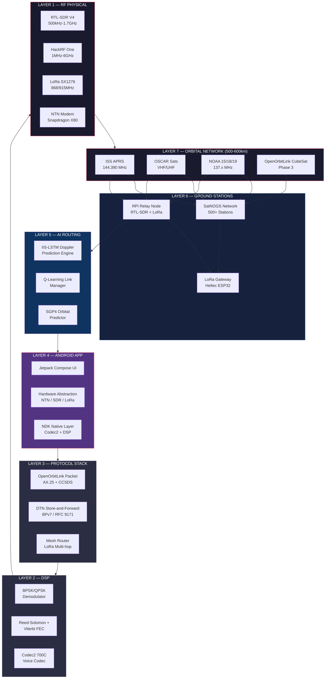
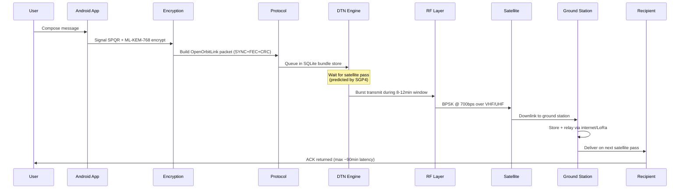
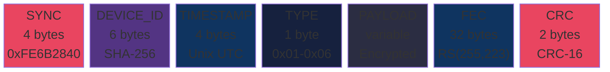
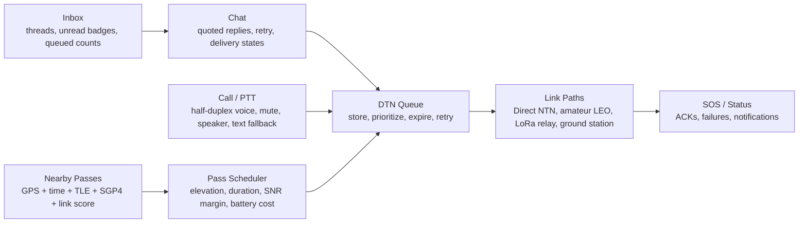
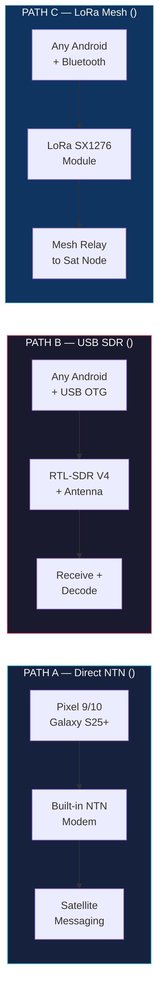
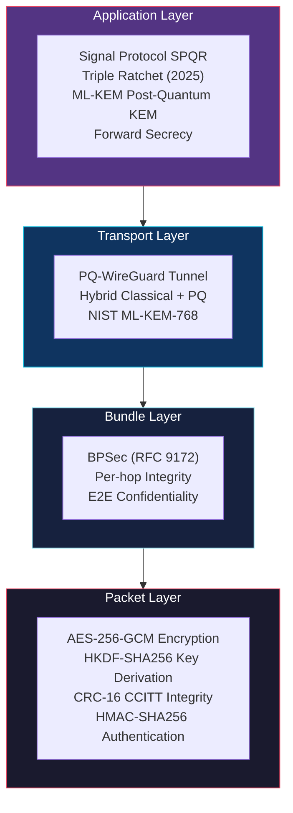
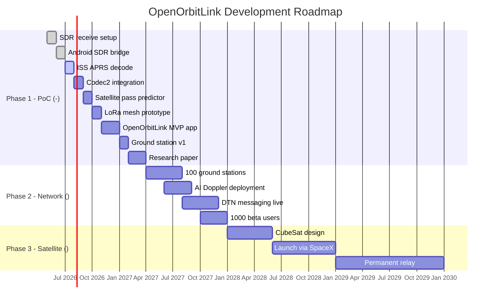

<div align="center">

#  OpenOrbitLink — Open Satellite Communication System

### The world's first open, decentralised, AI-adaptive satellite communication system.

[](https://www.gnu.org/licenses/gpl-3.0)
[](https://python.org)
[](https://rust-lang.org)
[](https://kotlinlang.org)
[](https://developer.android.com)
[](https://tensorflow.org)
[](https://gnuradio.org)
[](https://docker.com)

---

**3.5 Billion** People Unconnected | **700 bps** Voice via Codec2 | **$0** Cost to Users | **LEO + Amateur** Satellite Networks

*May 2026 | Open Research Initiative | v1.0*

</div>

---

##  Table of Contents

- [Mission](#-mission)
- [System Architecture](#-system-architecture)
- [Tech Stack](#-tech-stack)
- [Performance Specifications](#-performance-specifications)
- [Features](#-features)
- [Product Layer Roadmap](#-product-layer-roadmap)
- [Three Device Paths](#-three-device-paths)
- [Layer-by-Layer Breakdown](#-layer-by-layer-breakdown)
- [Security Architecture](#-security-architecture)
- [Quick Start](#-quick-start)
- [Deployment](#-deployment)
- [Research Papers](#-research-papers)
- [Roadmap](#-roadmap)
- [Legal Compliance](#-legal-compliance)
- [Contributing](#-contributing)
- [License](#-license)

---

##  Mission

> *For the 3.5 billion people still waiting for their first connection.*

Build a **free, open-source satellite communication platform** that works on any Android phone — no carrier, no subscription, no corporation. Combining SDR hardware, LoRa mesh networking, amateur satellites, AI-driven routing, and ultra-low-bitrate voice to deliver **resilient communication** for:

-  **Remote communities** with zero cellular coverage
-  **Disaster response** when terrestrial infrastructure fails
-  **Humanitarian operations** in conflict zones
-  **Wilderness safety** for hikers and expeditions
-  **Scientific research** in polar and maritime environments

---

##  System Architecture

### High-Level Overview



### Data Flow — Message Lifecycle



### Protocol Packet Structure



---

##  Tech Stack

<div align="center">

| Layer | Technology | Purpose |
|:---:|:---|:---|
|  | **Python 3.11+** | AI/ML models, DSP, Ground station, Simulation |
|  | **Rust 1.75+** | Protocol core (packet encoding, FEC, routing) |
|  | **Kotlin 2.0** | Android app (Jetpack Compose UI) |
|  | **C/C++ (NDK)** | Codec2 voice, DSP engine, SDR bridge |
|  | **TensorFlow Lite** | On-device Doppler prediction (<5ms) |
|  | **GNU Radio 3.10** | SDR signal processing flowgraphs |
|  | **SQLite** | DTN bundle store, message queue |
|  | **Docker** | Ground station + simulation containers |
|  | **SGP4/SDP4** | Orbital mechanics & pass prediction |
|  | **Signal SPQR** | Post-quantum end-to-end encryption |

</div>

---

##  Performance Specifications

### Latency Budget

| Metric | Value | Notes |
|:---|:---:|:---|
| **Message E2E latency** | 45-90 min | Single orbit period (LEO ~92min) |
| **Satellite pass window** | 8-12 min | Usable contact per pass |
| **Doppler prediction** | <5 ms | TFLite INT8 on Pixel Tensor G4 |
| **Packet serialization** | <0.1 ms | Rust protocol core |
| **SGP4 pass prediction** | ~254 ms | 24hr window, 5+ passes found |
| **Codec2 encode/decode** | <1 ms | Per 40ms voice frame |
| **CRC-16 + FEC** | <0.05 ms | Per packet |
| **PLC gap reconstruction** | <3 ms | Neural WaveRNN inference |
| **LoRa mesh relay** | 50-200 ms | Per hop (SF7-SF12) |

### Bandwidth & Throughput

| Channel | Bitrate | Modulation | Required SNR | Use Case |
|:---|:---:|:---:|:---:|:---|
| **Voice** | 700 bps | BPSK | 3 dB | Codec2 700C satellite voice |
| **Text** | 1,200 bps | BPSK | 5 dB | Text messaging |
| **Data** | 2,400 bps | QPSK | 7 dB | File transfer |
| **LoRa Mesh** | 293 bps | LoRa SF12 | -20 dB | Weak signal relay |
| **LoRa Fast** | 5,470 bps | LoRa SF7 | -7.5 dB | Short-range mesh |

### Link Budget — ISS @ 145.8 MHz

| Elevation | Range | SNR | Margin | Status |
|:---:|:---:|:---:|:---:|:---:|
| 10 deg | 1,461 km | 22.3 dB | +16.3 dB | VIABLE |
| 30 deg | 753 km | 28.1 dB | +22.1 dB | VIABLE |
| 45 deg | 561 km | 30.7 dB | +24.7 dB | VIABLE |
| 90 deg | 408 km | 33.4 dB | +27.4 dB | VIABLE |

> TX: 200mW (23 dBm) | Phone antenna: 0 dBi | Sat antenna: 2 dBi | Noise temp: 500K

### Voice Quality

| Codec | Bitrate | MOS Score | Latency | Frame |
|:---|:---:|:---:|:---:|:---:|
| Codec2 700C | 700 bps | 2.5-3.0 | 40 ms | 28 bits/frame |
| Codec2 + Neural PLC | 700 bps | 3.0-3.5 | 43 ms | +WaveRNN gap-fill |
| AMR-NB (cellular ref) | 12,200 bps | 4.0+ | 20 ms | Reference |

---

##  Features

### Core Communication
- **Satellite Text Messaging** -- 256-byte encrypted messages via ISS APRS / OSCAR digipeaters
- **Conversation Inbox** -- thread list with unread badges, queued counts, retry state, and pass-aware previews
- **Chat Timeline** -- quoted replies, voice-burst placeholders, attachment entry point, and clear queued/waiting/sent/delivered/failed states
- **700bps Satellite Voice** -- Codec2 700C with neural PLC gap-filling for interruptions
- **Push-to-Talk Calling** -- half-duplex call screen with mute, speaker route, packet-loss quality, and text fallback
- **Emergency SOS** -- One-tap GPS + distress signal with haptic feedback via all channels
- **Delivery Confirmation** -- ACK packets returned on subsequent satellite pass
- **Store-and-Forward** -- DTN bundle engine queues messages during blackout periods

### Interactive Maps & Visualization
- **Live Satellite Map** -- osmdroid map with real-time ISS/NOAA/OSCAR positions and ground tracks
- **Ground Station Pins** -- SatNOGS 500+ stations + custom OpenOrbitLink nodes on global map
- **Pass Footprint Overlay** -- Visibility cone showing satellite coverage area
- **Nearby Pass Discovery** -- foreground pass engine surfaces visible-now, next-pass, and best-reliability cards
- **3D Orbit Viewer** -- Interactive globe with animated orbital paths (planned)

### Link Telemetry Dashboard
- **Animated SNR Gauge** -- Real-time circular gauge with color-coded signal quality
- **Doppler Shift Dial** -- Analog-style needle showing frequency offset with AI compensation
- **BER/FEC Metrics** -- Live bit error rate, FEC corrections, packet success counters
- **Pass Progress Timeline** -- AOS/TCA/LOS markers with elapsed time indicator

### AR Sky Scanner (Inspired by Starlink SkyScan)
- **Polar Sky Plot** -- Full compass-aligned sky visibility visualization
- **Radar Sweep Animation** -- Scanning beam with gradient glow
- **Satellite Pass Arc** -- Predicted ISS trajectory overlaid on sky plot
- **Obstruction Analysis** -- Clear sky / partial / blocked percentage breakdown

### Network Path Visualizer
- **Animated Data Flow** -- Live packet animation along Phone > LoRa > Ground Station > Satellite path
- **Per-Hop Latency** -- Color-coded latency indicators for each network hop
- **Speed Test Module** -- Measure actual throughput over satellite/mesh links

### Ground Station Remote Control
- **gRPC Telemetry Streaming** -- Real-time signal strength, temperature, packet feed
- **Antenna Control** -- Az/El sliders with auto-track mode for satellite following
- **Frequency Tuning** -- Preset buttons (ISS APRS, NOAA-19, CW Beacon) + manual dial
- **Decoded Packet Feed** -- Live scrolling feed of decoded satellite transmissions
- **Protobuf API** -- 7 RPCs, 15 message types defined in `ground_station/freesat.proto`

### Hardware Setup Wizard
- **3-Path Selection** -- Interactive cards for NTN ($0), SDR ($50-80), LoRa ($10-12)
- **Step-by-Step Checklists** -- Expandable setup steps with completion tracking
- **Cost BOM** -- Per-path hardware bill of materials with pricing
- **USB Device Detection** -- Automatic SDR hardware recognition

### AI & Machine Learning
- **Neural Doppler Prediction** -- IIS-LSTM model compensates +/-10kHz LEO Doppler shift in real-time
- **Adaptive Link Selection** -- Q-learning agent picks optimal satellite from pass candidates
- **Speech Enhancement** -- WaveRNN-inspired neural gap-filling reconstructs lost voice frames
- **Pass Quality Scoring** -- Multi-factor scoring: elevation (50%), duration (30%), Doppler (20%)

### Mesh Networking
- **LoRa Multi-hop Relay** -- SX1276 mesh extends satellite access to devices without SDR
- **BLE Discovery** -- Bluetooth Low Energy neighbor scanning for local mesh topology
- **Satellite-Aware Routing** -- Routes through nodes with satellite access or ground station proximity
- **Deduplication** -- Hash-based packet dedup prevents relay loops

### Security & Privacy
- **End-to-End Encryption** -- Signal Protocol SPQR (Triple Ratchet) + ML-KEM-768 post-quantum
- **Biometric Lock** -- Fingerprint/face unlock for encrypted message access
- **Bundle Security** -- BPSec RFC 9172 per-hop integrity + E2E confidentiality
- **Forward Secrecy** -- Key ratcheting ensures compromise of one key doesn't expose history
- **Tamper Detection** -- CRC-16 CCITT + HMAC-SHA256 integrity verification

### Signal Processing
- **BPSK/QPSK Demodulation** -- GNU Radio-based satellite signal decoding
- **Reed-Solomon FEC** -- RS(255,223) corrects up to 16 symbol errors per block
- **Barker-13 Synchronization** -- Low autocorrelation sync word detection
- **NOAA APT Decoding** -- Weather satellite image reception (137 MHz)
- **ISS APRS Decoding** -- AX.25 packet parsing from International Space Station

### Ground Station Infrastructure
- **SatNOGS Integration** -- 500+ station network for global coverage
- **gRPC Server** -- Python `grpc.aio` server with telemetry streaming, antenna control, waterfall data
- **Auto-Tracking** -- TLE-driven antenna pointing via GPredict/rotctl
- **LoRa Gateway** -- Bridge LoRa mesh to satellite + internet
- **Docker Deployment** -- One-command ground station setup
- **Satellite Pass Alerts** -- Push notifications for upcoming high-elevation passes

---

##  Product Layer Roadmap

The app is organized around one user promise: show who can be reached, what will happen next, when the next usable pass opens, and whether a message or voice burst is likely to make it.



| Surface | Implemented shape | Why it matters |
|:---|:---|:---|
| Inbox | Thread cards with unread badges, queued counts, next pass, and reliability | Users see pending work before opening a chat |
| Chat | Delivery state model, quoted replies, retry action, voice burst rows, attachment entry point | Satellite messaging is delayed, so state clarity is the product |
| Call / PTT | Dedicated half-duplex screen with packet-loss quality, controls, and text fallback | Voice over intermittent links should behave like bursts, not cellular calls |
| Nearby Passes | Scored visible-now / next-pass / best-reliability cards | Continuous discovery is battery-aware pass prediction, not blind scanning |
| Background Engine | Foreground-service skeleton and shared `NearbyPassScorer` | Android background limits require user-visible discovery with controlled refresh |

The D2D/NTN research direction is reflected in the scoring model: hybrid TN/NTN paths are treated as complementary, low-elevation contacts are penalized unless link margin is strong, and reliability is driven by elevation, pass duration, SNR margin, and battery wait cost.

---

##  Three Device Paths



| Path | Phone | Hardware | Capability | Cost |
|:---|:---|:---|:---|:---:|
| **A — Direct NTN** | Pixel 9/10, Galaxy S25+ | None (built-in) | Full satellite messaging | **** |
| **B — USB SDR** | Any Android + USB OTG | RTL-SDR V4 () + antenna () | Receive + decode signals | **** |
| **C — LoRa Mesh** | Any Android + Bluetooth | LoRa SX1276 () | Mesh relay to satellite node | **** |

---

##  Layer-by-Layer Breakdown

### Layer 1: RF Physical
| Device | Chip | Freq Range | TX/RX | Cost | Role |
|:---|:---|:---|:---:|:---:|:---|
| RTL-SDR V4 | R828D | 500kHz–1.766GHz | RX |  | Satellite receive |
| HackRF One | MAX2837 | 1MHz–6GHz | TX/RX |  | Experimental |
| LoRa SX1276 | Semtech | 137–1020MHz | TX/RX |  | Mesh relay |
| Snapdragon X80 | Qualcomm 4nm | NB-NTN R17 | TX/RX | Built-in | NTN modem |
| Exynos 5300 | Samsung 4nm | 3GPP R17 | TX/RX | Built-in | NTN modem |

### Layer 2: DSP / Signal Processing
| Function | Algorithm | Performance |
|:---|:---|:---|
| Modulation | BPSK (robust) / QPSK (throughput) | <0.1ms encode |
| FEC | Reed-Solomon RS(255,223) | 16 symbol error correction |
| Convolutional | Viterbi k=7, r=1/2 | 3dB coding gain |
| Sync | Barker-13 correlator | -20dB detection |
| Voice | Codec2 700C (28 bits/40ms) | <1ms per frame |

### Layer 3: Protocol Stack
| Payload | Code | Max Size | TTL | Priority |
|:---|:---:|:---:|:---:|:---:|
| TEXT | 0x01 | 256 B | 24 hr | Normal |
| VOICE | 0x02 | 1024 B | 1 hr | High |
| SOS | 0x03 | 64 B | Never | Critical |
| RELAY | 0x04 | 2048 B | 24 hr | Normal |
| ACK | 0x05 | 16 B | 2 hr | High |
| BEACON | 0x06 | 32 B | 10 min | Low |

### Layer 4: Android App (13 Screens + 1 Discovery Engine)
- **UI**: Jetpack Compose + Material 3 + glassmorphism dark space theme
- **Primary (Bottom Nav)**: Messages, Satellite Map, Link Dashboard, SOS, Hub
- **Secondary (Hub)**: Nearby Passes, Call/PTT, Satellite Tracker, Mesh Network, Sky Scanner, Network Path, Ground Station, Hardware Setup
- **Messaging UX**: Inbox, chat timeline, quoted replies, retry, voice burst, unread badges, and DTN delivery states
- **Foreground Discovery**: `NearbyPassService` + `NearbyPassScorer` for pass notifications and visible-now/next/best cards
- **NDK**: libcodec2.so (voice), libOpenOrbitLink_dsp.so (signals), sdr_bridge.so (USB SDR)
- **Camera**: CameraX integration for AR sky scanner
- **Maps**: osmdroid with offline tile caching
- **Haptics**: Haptic feedback on SOS button and satellite lock events
- **DB**: Room + SQLite for DTN bundle persistence
- **ML**: TensorFlow Lite for on-device Doppler inference
- **Auth**: BiometricPrompt for encrypted message access

### Layer 5: AI Routing
- **Doppler Model**: 2-layer IIS-LSTM (64→32 units), INT8 quantized, <5ms inference
- **Link Manager**: Multi-factor scoring + Q-learning with epsilon-greedy exploration
- **Orbital Predictor**: SGP4 batch propagation, 5 ISS passes predicted in ~254ms

### Layer 6: Ground Stations
- **Hardware**: RPi 4 + RTL-SDR V4 + UHF Yagi + LoRa gateway (~ total)
- **Software**: SatNOGS client + GNU Radio + OpenOrbitLink relay daemon + gRPC server
- **gRPC API**: 7 RPCs (GetStatus, GetTelemetry, StreamPackets, StreamWaterfall, ControlAntenna, SetFrequency, RunSpeedTest)
- **Protocol**: Protobuf service definition (`ground_station/freesat.proto`) with 15 message types
- **Network**: 500+ SatNOGS stations, 11M+ observations worldwide
- **Power**: ~15W, solar-capable for remote deployment

### Layer 7: Orbital Network
| Satellite | Frequency | Capability | License |
|:---|:---|:---|:---|
| ISS APRS | 144.390 MHz | Text + position | Ham (TX) |
| NOAA 15/18/19 | 137.x MHz | Weather APT | None (RX) |
| OSCAR series | VHF/UHF | Voice + data | Ham |
| TinyGS network | LoRa 433/868 | LoRa satellite RX | None (RX) |

---

##  Security Architecture



| Threat | Mitigation |
|:---|:---|
| Signal interception | E2E encryption (Signal + ML-KEM) |
| Replay attacks | Timestamp + nonce in every packet |
| Quantum harvest-now | Post-quantum KEM (ML-KEM-768) |
| Rogue ground station | BPSec per-hop authentication |
| Device compromise | Android Keystore secure enclave |
| Jamming/interference | Frequency hopping + spread spectrum |

---

##  Quick Start

### Prerequisites

| Tool | Version | Purpose |
|:---|:---|:---|
| Python | 3.9+ | AI, DSP, simulation, ground station |
| Rust | 1.75+ | Protocol core (optional) |
| Android Studio | Ladybug+ | App development (optional) |
| GNU Radio | 3.10+ | SDR flowgraphs (optional) |
| Docker | 24+ | Ground station deployment (optional) |

### Installation

```bash
# Clone
git clone https://github.com/OpenOrbitLink-project/OpenOrbitLink.git
cd OpenOrbitLink

# Python setup
python -m venv .venv
source .venv/bin/activate      # Linux/Mac
# .venv\Scripts\activate       # Windows
pip install -r requirements.txt

# Run tests
python tests/test_e2e.py

# Run satellite pass predictor
python -m ai.orbital_predictor --lat 28.6139 --lon 77.2090 --hours 24

# Run link budget simulation
python simulation/link_budget.py

# Run constellation coverage analysis
python simulation/constellation_sim.py --hours 24

# Fetch latest TLE satellite data
python scripts/fetch_tle.py --all-OpenOrbitLink

# Start ground station (requires RTL-SDR hardware)
python -m ground_station.grpc_server --station-id FS-GS-001 --port 50051

# Docker deployment
cd docker && docker-compose up -d
```

### Rust Protocol (Optional)
```bash
cd protocol-rs
cargo test          # Run unit tests
cargo build --release
```

---

##  Deployment

### Docker Ground Station
```bash
cd docker
docker-compose up -d ground-station
# gRPC endpoint: localhost:50051
```

### Raspberry Pi Ground Station
```bash
# Flash RPi OS Lite 64-bit, then:
sudo apt install -y python3-pip librtlsdr-dev
git clone https://github.com/OpenOrbitLink-project/OpenOrbitLink.git
cd OpenOrbitLink && pip install -r requirements.txt
python -m ground_station.grpc_server --station-id FS-GS-YOUR-CALL --port 50051
```

### Hardware BOM — Ground Station (~)
| Item | Cost |
|:---|:---:|
| Raspberry Pi 4 (4GB) |  |
| RTL-SDR V4 |  |
| UHF Yagi Antenna |  |
| LoRa Gateway (Heltec) |  |
| GPS Module (NEO-6M) |  |
| SD Card + PSU + Cables |  |

---

##  Research Papers

### Product and NTN Reference Inputs

The implementation-focused reading order is maintained in [`docs/reading-plan.md`](docs/reading-plan.md).

| Reference | Relevance |
|:---|:---|
| Direct-to-Device Connectivity for Integrated Communication, Navigation and Surveillance (IEEE ICNS 2026 / arXiv:2603.11848) | Supports hybrid TN/NTN design, elevation-aware link scoring, and reliability-first ICNS UX |
| DTN / contact-aware routing literature | Supports queued, delayed, retryable message states instead of normal instant-message assumptions |
| Android background execution model | Requires foreground, user-visible nearby-pass discovery instead of hidden constant scanning |

### OpenOrbitLink Research Targets

| Title | Target Venue | Status |
|:---|:---|:---:|
| OpenOrbitLink: Open Decentralised D2D Satellite Protocol | IEEE Comm. Magazine | Planning |
| Neural Doppler Compensation for Consumer LEO D2D | ACM MobiCom | Training |
| Codec2 + Neural Gap-Fill for Satellite Voice | IEEE Trans. Comms | Integration |
| Crowdsourced Ground Station Architecture | Nature Comms. | Data Collection |
| Post-Quantum Security for DTN Satellite Networks | IEEE S&P | Protocol Design |

---

##  Roadmap



---

##  Legal Compliance

| | Rule |
|:---:|:---|
| **YES** | Uses only amateur/research/ISM frequency bands |
| **YES** | Requires amateur radio license for TX operations |
| **YES** | Fully compliant with ITU Article 25 |
| **YES** | NOAA/TinyGS receive is license-free |
| **NO** | No carrier bypassing or unauthorized spectrum use |
| **NO** | No Starlink/Skylo packet injection |
| **NO** | No baseband firmware modification |

---

##  Contributing

See [CONTRIBUTING.md](CONTRIBUTING.md) for guidelines. We welcome:

- **SDR Engineers** — GNU Radio flowgraph optimization
- **Ham Radio Operators** — Satellite contacts and testing
- **Android Developers** — Jetpack Compose UI + USB OTG
- **ML Researchers** — Doppler prediction + speech enhancement
- **Security Engineers** — Post-quantum protocol implementation
- **Hardware Builders** — Antenna designs + ground station builds

---

##  License

GNU General Public License v3.0 — see [LICENSE](LICENSE).

This is **free software**: you can redistribute it and/or modify it under the terms of the GPLv3.

---

<div align="center">

### Built with purpose. Open forever.

**OpenOrbitLink Research Initiative** | May 2026 | Open Source

*Dedicated to the 3.5 billion people still waiting for their first connection.*

[](https://github.com/OpenOrbitLink-project/OpenOrbitLink)

</div>
