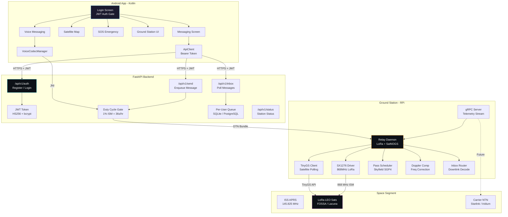
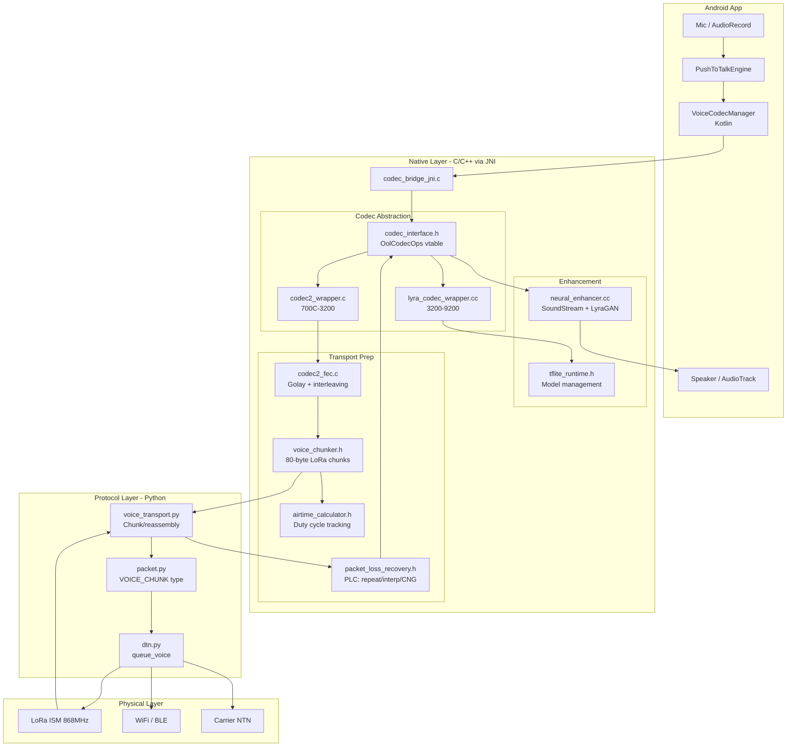
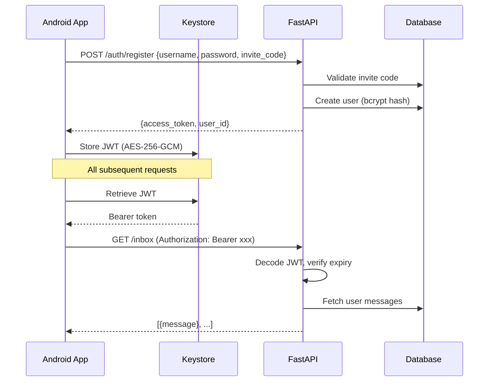
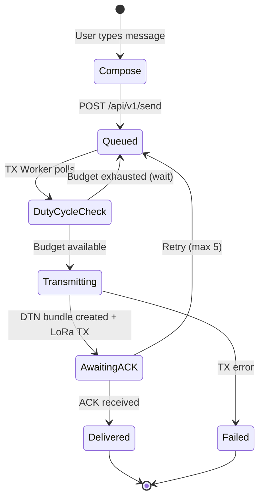
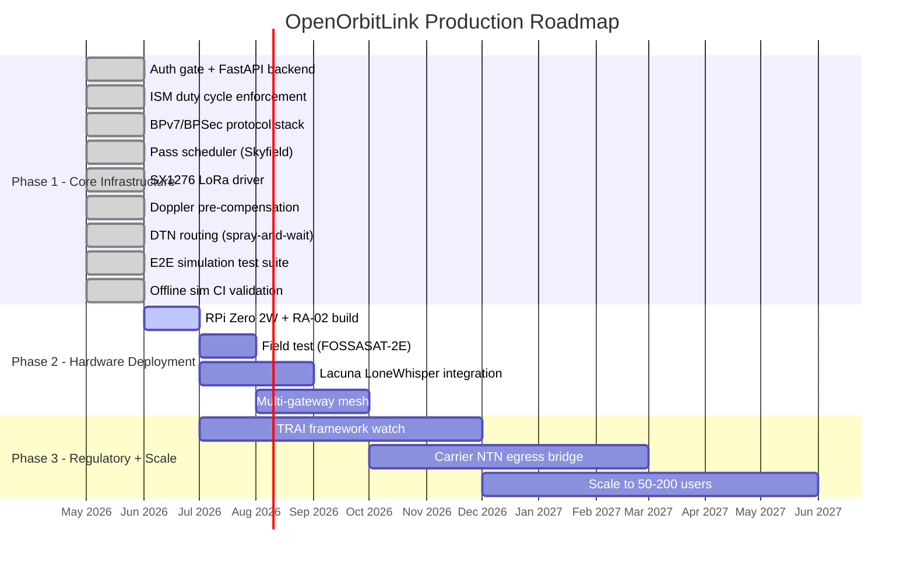

<p align="center">
  <h1 align="center">🛰️ OpenOrbitLink</h1>
  <p align="center">
    <strong>Open-source delay-tolerant satellite messaging over LoRa, mesh relays, and ground-station networks</strong>
  </p>
  <p align="center">
    <a href="#quick-start">Quick Start</a> •
    <a href="#architecture">Architecture</a> •
    <a href="#backend-api">Backend API</a> •
    <a href="#android-app">Android App</a> •
    <a href="#roadmap">Roadmap</a>
  </p>
</p>

<p align="center">


</p>

---

OpenOrbitLink is an open research stack for delay-tolerant messaging over LoRa,
amateur packet radio, mesh relays, and ground-station networks.

It is not a magic phone-to-satellite transmitter. Android phones cannot transmit
arbitrary VHF/UHF/LoRa RF by themselves, RTL-SDR dongles are receive-only, and
amateur satellite paths have strict licensing and plaintext rules. This repo now
treats those constraints as protocol behavior, not footnotes.

## Tech Stack

<table>
<tr>
<td align="center" width="96"><br><sub><b>Python</b></sub></td>
<td align="center" width="96"><br><sub><b>Kotlin</b></sub></td>
<td align="center" width="96"><br><sub><b>FastAPI</b></sub></td>
<td align="center" width="96"><br><sub><b>SQLite</b></sub></td>
<td align="center" width="96"><br><sub><b>Docker</b></sub></td>
<td align="center" width="96"><br><sub><b>Android</b></sub></td>
<td align="center" width="96"><br><sub><b>C / NDK</b></sub></td>
<td align="center" width="96"><br><sub><b>Raspberry Pi</b></sub></td>
</tr>
<tr>
<td align="center" width="96"><br><sub><b>Gradle</b></sub></td>
<td align="center" width="96"><br><sub><b>gRPC</b></sub></td>
<td align="center" width="96"><br><sub><b>Protobuf</b></sub></td>
<td align="center" width="96"><br><sub><b>NumPy</b></sub></td>
<td align="center" width="96"><br><sub><b>Pytest</b></sub></td>
<td align="center" width="96"><br><sub><b>GitHub CI</b></sub></td>
<td align="center" width="96"><br><sub><b>LoRa SX1276</b></sub></td>
<td align="center" width="96"><br><sub><b>TinyGS</b></sub></td>
</tr>
<tr>
<td align="center" width="96"><br><sub><b>TFLite</b></sub></td>
<td align="center" width="96"><br><sub><b>CMake</b></sub></td>
<td align="center" width="96"><br><sub><b>Codec2</b></sub></td>
<td align="center" width="96"><br><sub><b>Lyra</b></sub></td>
<td align="center" width="96"><br><sub><b>C++ 17</b></sub></td>
<td align="center" width="96"><br><sub><b>Rust</b></sub></td>
</tr>
</table>

**Additional:** Jetpack Compose • Material3 • Signal Protocol • AES-256-GCM • BPv7/BPSec • SGP4 • CelesTrak • SatNOGS • Codec2 • Lyra/SoundStream • TFLite NNAPI • Golay FEC • RTL-SDR • Semtech LR2022 • Lacuna Space

## Architecture



### Hybrid Voice Codec



### Auth Flow



### Message Lifecycle



### Roadmap



## What Works Today

| Path | Status | Encryption | License | Notes |
|:---|:---|:---:|:---:|:---|
| Android → FastAPI → LoRa node → ISM satellite/ground | **Production MVP** | Yes | Region rules only | JWT auth gate, per-user queues, duty-cycle rate limiting. |
| Satellite pass scheduling (Skyfield SGP4) | **Implemented** | N/A | N/A | Auto-schedules TX bursts during FOSSASAT-2E / ISS passes. |
| Doppler pre-compensation | **Implemented** | N/A | N/A | Real-time frequency correction for LEO satellite passes. |
| SX1276 LoRa driver (HW + simulation) | **Implemented** | N/A | Region rules only | Full async TX/RX with simulation mode for dev. |
| DTN routing (epidemic/spray-and-wait) | **Implemented** | N/A | N/A | Multi-hop mesh relay with deduplication. |
| BPv7/BPSec bundle security | **Implemented** | BIB+BCB | Band-aware | RFC 9171/9172 compliant; BCB blocked on amateur bands. |
| APRS-IS internet bridge | **Implemented** | No | Ham TX required | Callsign validation, passcode computation, ISS fallback. |
| TinyGS-compatible ground station receive/poll | Adapter added | N/A | No TX license for RX | Use existing station infrastructure. |
| ISS APRS / amateur AX.25 | Decode and frame helpers | No | Ham TX required | Only valid APRS/AX.25 traffic; not arbitrary encrypted chat. |
| RTL-SDR V4 | Receive only | N/A | RX usually license-free | Good for NOAA/APRS receive demos, not uplink. |
| Carrier NTN (Pixel 9+, Galaxy S25+) | Convergence target | App-layer | Carrier plan required | Closed uplink; OpenOrbitLink bridges DTN → NTN gateway. |

## Backend API

The FastAPI backend provides authenticated REST endpoints for the Android app.

### Endpoints

| Method | Path | Auth | Description |
|--------|------|:----:|-------------|
| `POST` | `/api/v1/auth/register` | — | Register with invite code |
| `POST` | `/api/v1/auth/login` | — | Login → JWT token |
| `GET` | `/api/v1/auth/me` | Bearer | User profile |
| `POST` | `/api/v1/send` | Bearer | Enqueue message for satellite TX |
| `GET` | `/api/v1/inbox` | Bearer | Poll received messages |
| `GET` | `/api/v1/queue` | Bearer | Outbound queue status |
| `GET` | `/api/v1/status` | Bearer | Station status + duty cycle |
| `GET` | `/api/v1/passes` | Bearer | Upcoming satellite passes (Skyfield) |
| `GET` | `/api/v1/passes/next` | Bearer | Next pass ETA + countdown |
| `GET` | `/api/v1/passes/duty` | Bearer | Current duty cycle budget |
| `GET` | `/api/v1/health` | — | Health check |

### Quick Start (Backend)

```bash
# Install backend dependencies
pip install -r backend/requirements.txt

# Run the API server
python -m uvicorn backend.main:app --reload --port 8000

# Register a user
curl -X POST http://localhost:8000/api/v1/auth/register \
  -H "Content-Type: application/json" \
  -d '{"username":"pilot","password":"orbit2026!","invite_code":"BETA-OOL-2026"}'

# Send a message
curl -X POST http://localhost:8000/api/v1/send \
  -H "Authorization: Bearer <token>" \
  -H "Content-Type: application/json" \
  -d '{"text":"Hello from orbit","destination":"ground-team","band":"ism"}'
```

### Docker Deployment

```bash
cd docker
docker compose up --build -d

# Verify
curl http://localhost:8000/api/v1/health
```

## Android App

The Android app requires authentication before accessing any RF/DTN functionality.

- **Login Screen** — JWT auth with orbital animation, invite code for registration
- **Token Storage** — Android Keystore (EncryptedSharedPreferences, AES-256-GCM)
- **API Client** — All calls include Bearer token, auto-logout on 401
- **Auth Gate** — No RF, messaging, or DTN screens accessible without valid token

## Production Constraints

| Constraint | Impact |
|:---|:---|
| ISM duty cycle (1%) | ~36 sec/hour TX time per frequency -- shared across ALL users |
| 577 bps effective throughput | Very low capacity; not suitable for many concurrent users |
| Voice only as async messaging | PTT voice messages via Codec2 700C; NOT real-time VoIP |
| India regulatory status | TRAI recommendations exist but D2D NTN not yet consumer-available |
| Hardware dependency | Every "user" ultimately shares one physical LoRa node |
| Max beta users | ~10–20 (one LoRa node, shared ISM duty cycle is the ceiling) |

## Why OpenOrbitLink still matters alongside NTN

Carrier NTN (Starlink/T-Mobile, Skylo/Google/Verizon, and Galaxy operator
rollouts) is real on flagship phones, but it is carrier-gated, region-gated,
and optimized first for emergency messaging, SMS, and selected low-bandwidth
apps. In India, direct-to-device carrier NTN remains a regulatory and operator
integration target: TRAI had an open satellite network authorization
consultation dated 2026-04-08 and released satellite spectrum assignment
recommendations on 2026-05-15, but OpenOrbitLink should not assume consumer D2D
availability there yet.

OpenOrbitLink fills the gap: open ISM uplink, arbitrary DTN payloads,
end-to-end encryption on ISM bands, no carrier dependency, and a queue that can
eventually egress through a carrier NTN gateway when one is available.

## Core Features

- **JWT Authentication** -- Invite-code gated registration, bcrypt passwords, Keystore token storage.
- **Per-User DTN Queues** -- Messages queued in SQLite, transmitted in priority order.
- **ISM Duty Cycle Enforcement** -- 1% duty cycle rate limiter with per-user fair-share allocation.
- **Satellite Pass Scheduler** -- Skyfield SGP4 prediction for FOSSASAT-2E, ISS, Dream Big passes.
- **Doppler Pre-Compensation** -- Real-time frequency correction for LEO passes using range-rate.
- **SX1276 LoRa Driver** -- Async TX/RX with simulation mode; SPI hardware on RPi Zero 2W.
- **DTN Routing** -- Epidemic and spray-and-wait strategies with deduplication.
- **BPv7/BPSec Protocol Stack** -- RFC 9171/9172 compliant bundles with CBOR encoding.
- **APRS-IS Bridge** -- ISS APRS fallback via internet gateway with callsign validation.
- **Inbox Router** -- Automatic downlink decode, dedup, and per-user message routing.
- **Hybrid Voice Codec** -- Adaptive Codec2/Lyra codec stack with neural enhancement.
- **Regulatory Compliance Logging** -- Every TX logged with user ID, duration, frequency for ISM rules.
- Band-aware packet format with `TransmitBand` and encrypted-payload guard.
- Security policy that blocks ciphertext on amateur-band transmissions.
- Local license gate for callsign syntax, operator attestation, and amateur TX.
- LoRa/FOSSA-sized frame encoder with 80-byte frame limit.
- TinyGS API client scaffold using Bearer auth and base64 TX frame payloads.
- TLE fetcher that writes metadata JSON and warns on stale orbital data.
- Link-budget simulator with honest TX paths and effective throughput analysis.
- Offline `demo.py` simulation for contributors without RF hardware.
- **99-test suite** covering E2E simulation, protocol standards, voice pipeline, and rate limiting.

## Security Model

OpenOrbitLink separates integrity from confidentiality:

| Band | Confidentiality | Integrity/Auth | Reason |
|:---|:---:|:---:|:---|
| Amateur | Blocked | Allowed | Amateur rules prohibit obscuring message meaning. |
| ISM LoRa | Allowed | Allowed | Subject to regional ISM power, duty-cycle, and device rules. |
| Licensed private/commercial | Allowed | Allowed | Must follow the license or carrier agreement. |
| Carrier NTN | Allowed | Allowed | Requires operator service and standard phone modem support. |
| Receive-only | N/A | N/A | No transmit path exists. |

The Python crypto API now requires a band:

```python
crypto.encrypt(b"hello", key, band="ism")       # allowed
crypto.encrypt(b"hello", key, band="amateur")   # raises EncryptionPolicyError
```

## Link Budget Reality

| Path | TX Capable | Default Power | Frequency | Role |
|:---|:---:|:---:|:---:|:---|
| `LORA_ISM_UPLINK` | Yes | 100 mW | 868.1 MHz | External LoRa node satellite/mesh uplink. |
| `HAM_SDR_UPLINK` | Yes | 1 W | 145.825 MHz | Licensed amateur station only. |
| `HACKRF_EXPERIMENTAL` | Yes | 25 mW | 435 MHz | Lab path needing filtering/amplification/legal review. |
| `CARRIER_NTN` | No open uplink | Carrier-managed | NTN bands | Closed operator path for future DTN gateway egress. |
| `RTL_SDR_RX_ONLY` | No | N/A | VHF/UHF RX | Receive and decode only. |

At 700 bps, a 256-byte packet with the current 21-byte header, 32-byte FEC
field, and 2-byte CRC takes about 3.55 seconds on air. Effective payload rate is
about 577 bps before any additional overhead.

## What NOT to Build

| Feature | Reason |
|:---|:---|
| **VoIP / Calling** | VoIP over 577 bps is impossible. Voice is async PTT messaging only. |
| **Phone-direct RF** | Android phones cannot transmit LoRa. RTL-SDR is receive-only. This is a hardware law. |
| **Real-time chat** | DTN = store-and-forward. Minutes-to-hours latency is a *feature*. Market as async satellite messaging. |
| **Real-time voice streaming** | Use push-to-talk voice messages instead. Codec2 700C at 700 bps fits LoRa duty cycle for messages up to ~19s. |

## Legal Guardrails

- Amateur-band TX requires a valid amateur license and station identification.
- Amateur-band payloads must be plaintext; use BIB/integrity, not BCB/encryption.
- APRS support is for valid AX.25/APRS packets, not arbitrary encrypted chat.
- ISM use still depends on country-specific frequency, power, and duty-cycle limits.
- PSTN/Jio/Airtel calling is not possible directly from open LoRa/APRS satellite
  paths. It requires an internet VoIP bridge and a legal SIP/PSTN trunk.

See [docs/regulatory-compliance.md](docs/regulatory-compliance.md) and
[docs/ntn-comparison.md](docs/ntn-comparison.md).

## Quick Start

```bash
python -m venv .venv
.venv\Scripts\activate      # Windows PowerShell users can also use Activate.ps1
pip install -r requirements.txt
pip install -r backend/requirements.txt

# Run tests
python -m pytest -q

# Run offline simulation
python demo.py
python simulation/link_budget.py
python scripts/fetch_tle.py --all-openorbitlink --include-fossa

# Start the backend API
python -m uvicorn backend.main:app --reload --port 8000
```

## Key References

- FCC amateur prohibited transmissions: <https://www.ecfr.gov/current/title-47/chapter-I/subchapter-D/part-97/subpart-B/section-97.113>
- Android SatelliteManager API: <https://developer.android.com/reference/android/telephony/satellite/SatelliteManager>
- Google Pixel Satellite SOS availability: <https://support.google.com/pixelphone/answer/15254448>
- T-Mobile T-Satellite service limits: <https://www.t-mobile.com/coverage/satellite-phone-service>
- TRAI satellite spectrum recommendations, 2026-05-15: <https://trai.gov.in/notifications/press-release/trai-releases-recommendations-terms-and-conditions-assignment-spectrum>
- CelesTrak GP/TLE query format: <https://celestrak.org/NORAD/documentation/gp-data-formats.php>
- TinyGS programmatic API notes: <https://github.com/tinygs/tinyGS/wiki/Programmatic-API>
- FOSSA LoRa/ISM FAQ: <https://fossa.systems/frequently-asked-questions/>
- Lacuna Space LoneWhisper®: <https://lacuna.space/>
- Semtech LR2022 Gen 4: <https://www.semtech.com/>
- Iridium NTN Direct: <https://www.iridium.com/>

## License

GPLv3. This is research software; check local law before transmitting.
